Ejercicio práctico: Listado de Contactos
En este documento se mostrarán los pasos que se siguieron para crear la siguiente tabla en SAP Fiori, utilizando componentes de UI5 y haciendo llamado de servicios oData y REST API

  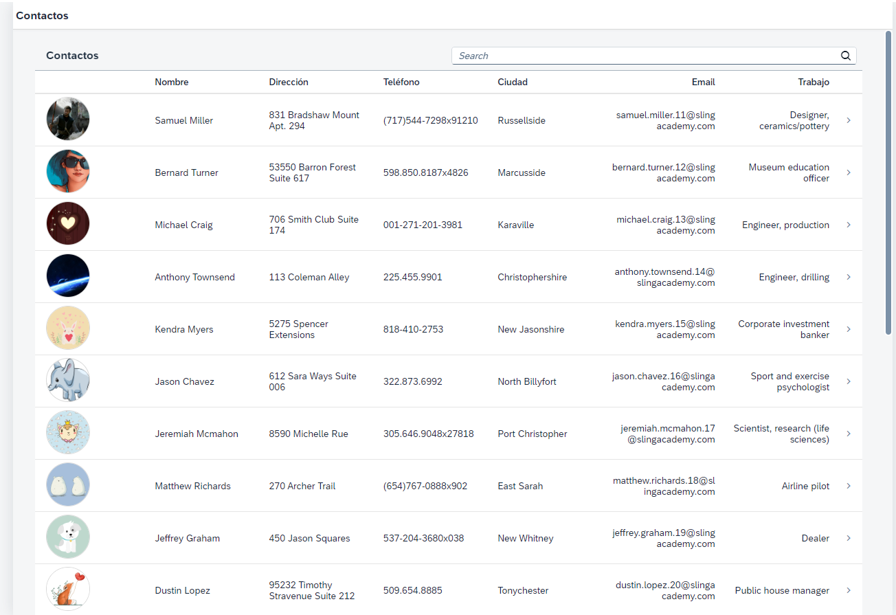
Luego de crear el proyecto de Fiori en el Business Application Studio se encontraran dentro de la carpeta de webapp los archivos de View1.controller.js, View1.view.xml y manifest.json (en caso de que a la vista se le allá asignado un nombre distinto al predeterminado, los archivos tendrán ese nombre en lugar de View1), estos archivos serán los que se modificaran durante el ejercicio.

  
 
Columna
https://sapui5.hana.ondemand.com/sdk/#/entity/sap.m.Column/sample/sap.m.sample.Table

   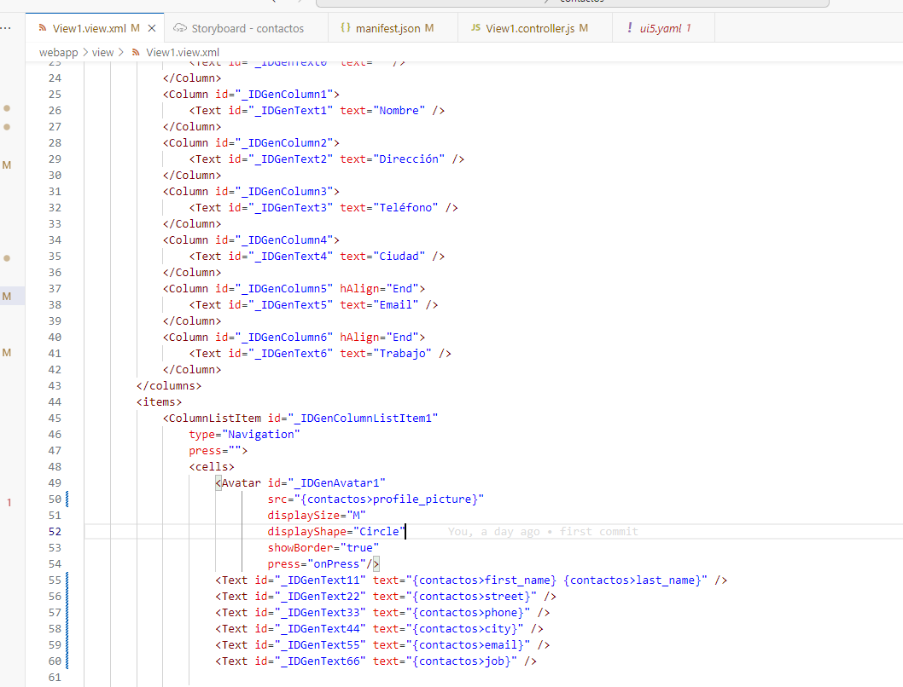
Para crear la tabla se utiliza la plantilla en el link de la documentación, en el archivo View1.view.xml se añade la tabla dentro de  <Page id="page" title="{i18n>title}">.

   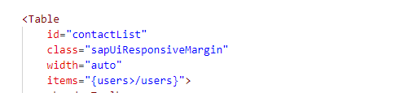
En id="contactList"le asignamos un nombre único para poder referenciar la tabla en el controlador mas adelante
La configuración de items="{contactos>/users}"> se realiza según el nombre que se le asignara al modelo cuando se configure el llamado del API más el parámetro dentro del cual se encuentre la data a llamar, en este caso el modelo lo llamamos contactos y la informacion que necesitamos se encuentra dentro de users:

   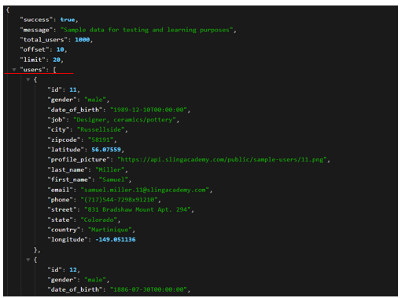
Para configurar la tabla, dentro de <columns> agregaremos los nombres de las columnas siguiendo el ejemplo de la plantilla, y dentro de <cells> se mapearan los valores que vienen del servicio que llenara la tabla, estos valores se asignaran a la columna según el orden en que los agreguemos.
Ejemplo:

   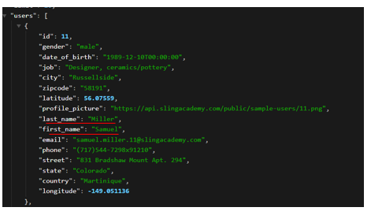
 
<Text id="_IDGenText11" text="{contactos>first_name} {contactos>last_name}" />

Para el valor de nombre en la segunda columna, se agrega un widget de tipo text, al cual se le asigna el parámetro de first_name y last_name, contactos se refiere al nombre del modelo luego > y luego el parámetro que se quiera llamar.
Para mostrar una imagen de perfil en la columna se requiere usar el widget de Avatar, se agrega en la celda de la misma forma que el de texto y en el parametro de src se le asigna el parametro del servicio que traiga el URL de la imagen:

   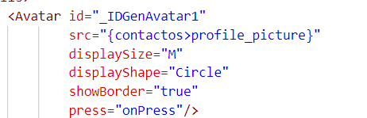

Servicio REST API
Para configurar el llamado de un REST API, se debe crear un modelo en el archivo de manifest.json:

   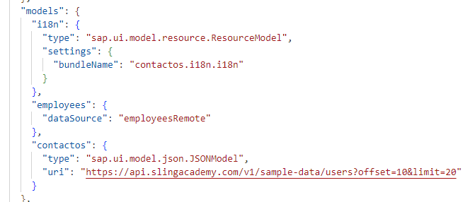
En la sección de sap.ui5, dentro de models, se agrega un nuevo modelo siguiendo el ejemplo de contactos, en uri se agrega el URL del API que se quiera llamar

   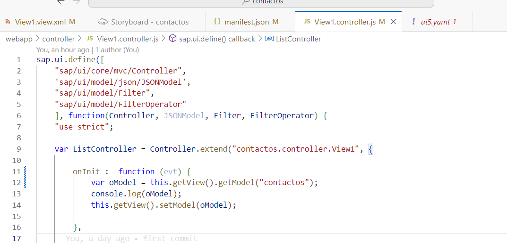
Luego en el controlador del view, se debe agregar a la definición 'sap/ui/model/json/JSONModel', para poder llamar el servicio json, en la función de onInit llamaremos al modelo contactos que se creó previamente con esta línea:
var oModel = this.getView().getModel("contactos");
Y luego le asignaremos la data a la vista con esta linea:
this.getView().setModel(oModel);

Con esto ya la columna que se creo previamente debería tener los datos mapeados y mostrarlos en la vista.

Servicio oData
https://sapui5.hana.ondemand.com/sdk/#/topic/44062441f3bd4c67a4f665ae362d1109
Para mapear un servicio oData el proceso es similar al de REST API con unas configuraciones añadidas:
Primero se debe abrir el terminal y ejecutar el siguiente comando:
npm i -D ui5-middleware-simpleproxy
El mismo creara los siguientes archivos en el proyecto:

   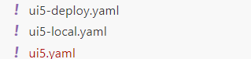
Se debe abrir el archivo ui5.yaml y al final del mismo se añadirá el URL base del servicio oData que se quiera llamar

   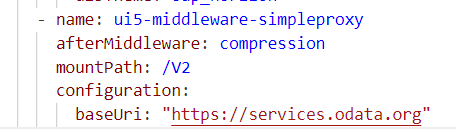
En el archivo de manifest.json en la sección de sap.app, agregaremos el dataSources, donde se configurara el resto del URL sin incluir el endpoint, ademas de configurar la version de oData que se esta utilizando, en este caso 2.0

   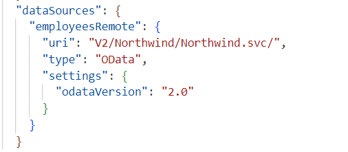
También se configurara en la sección de sap.ui5 el modelo igual que se hizo en el ejemplo de REST API, en este caso creamos el modelo de employees y se apunta el modelo al dataSource que se acaba de crear

   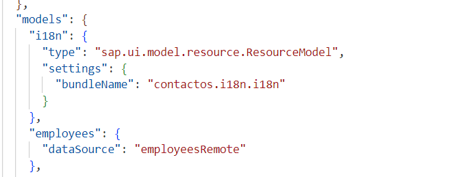
En el controlador se le asigna el models de la misma forma que el rest api. 

  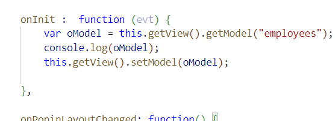
Luego de eso se mapean los valores del servicio en la columna que se creo

Filtro
Para crear un filtro en nuestra tabla se configurará un campo de búsqueda en el header de la tabla:

   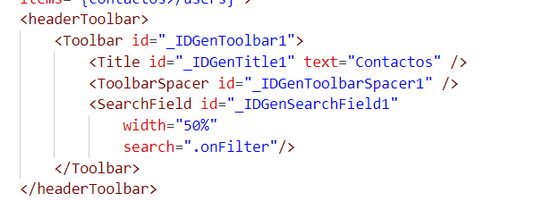
Al cual se le asigna dentro de SearchField la función de .onFilter, la cual se configurara en el controlador

  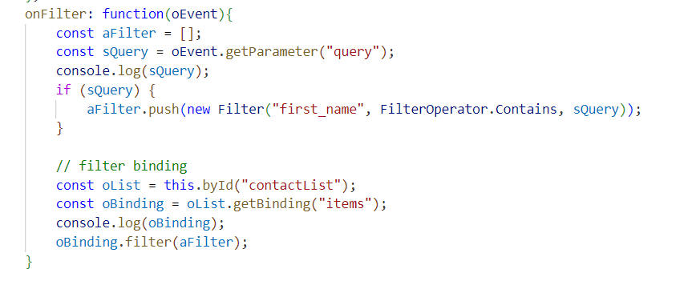
En esta función en la línea 
aFilter.push(new Filter("first_name", FilterOperator.Contains, sQuery));

Se le asigna el parametro first_name como el parámetro sobre el cual se realizara el filtro y en la línea
const oList = this.byId("contactList");

Se le asigna el id de la tabla que se creó, el resto del código se puede dejar igual, con esto, al escribir un nombre en la barra de búsqueda, la tabla nos mostrara entonces solo los usuarios que coincidan con el nombre

  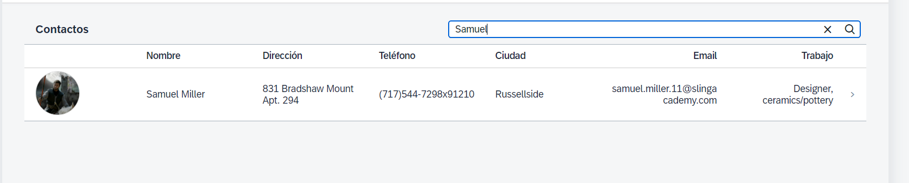
